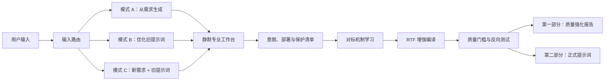

# 元提示词 v1.0 升级说明

## 升级判断

v0.6 已经具备 RTF 骨架、需求分类和基础质量检查，适合从清晰需求生成结构化提示词。V1.0 将系统扩展成一个双向提示词编译器：它既能从需求生成提示词，也能接收旧提示词，完成诊断、重构和优化。

这次升级的核心价值集中在三点：

- 系统先完成静默专业研判，再向用户呈现可审阅的意图理解和质量决策。
- 每次固定交付“意图与质量强化报告”和“正式提示词”两个部分。
- 质量判断由通用分数升级为有证据的诊断、修复和验证闭环。

## 架构变化

## v0.6 与 V1.0 的差异

| 维度 | v0.6 | V1.0 |
|---|---|---|
| 输入类型 | 主要处理自然语言需求 | 支持需求、旧提示词和混合输入 |
| 工作模式 | 单一路径生成 | 自动路由到生成或优化流程 |
| 意图处理 | 识别显性与隐性需求 | 建立目的、受众、场景、交付物、成功标准和优先级模型 |
| 过程呈现 | 正式提示词后附质量报告 | 先交付质量强化报告，再交付正式提示词 |
| 内部推理 | 没有显式边界 | 内部研判静默，外部只呈现结论、依据、假设和决策 |
| 对标学习 | 未形成机制 | 区分用户样例、权威来源、领域工作流和方法级对标 |
| 旧提示词诊断 | 缺失 | 增加 12 维诊断、问题分级、保留项和修复策略 |
| 提示词结构 | 固定 RTF | 以 RTF 为骨架，按需加入上下文、约束、验证、示例和异常处理 |
| 质量评估 | 通用百分制和效果预测 | 使用“通过、需修订、待确认、不适用”，每项都有诊断依据 |
| 验证方式 | 检查清单 | 增加标准输入、边缘输入和冲突输入的静默反向测试 |
| 信息不足 | 提示补充或使用默认值 | 默认值、假设、变量和暂定版提示词同时交付 |
| 来源诚实 | 未定义 | 禁止虚构检索、来源、测试和顶级认证 |
| 安全边界 | 较弱 | 增加提示注入隔离、权限、隐私、版权和高风险处理 |
| 复杂度控制 | 倾向完整模板 | 简单任务使用最小充分结构，复杂任务按价值扩展 |
| 部署适配 | 未识别 | 区分单轮提示词、模板、系统指令、Agent 工作流和提示词链 |
| 运行环境 | 未识别 | 增加目标模型、平台、消息层级、工具和机器解析方式 |
| 原文保护 | 依赖泛化的“保留意图” | 增加变量、标签、字段、字面量、示例和语言特征保护清单 |
| 验证口径 | 自检与效果预测混合 | 明确区分设计级静态测试与真实模型评测 |
| 报告深度 | 使用统一模板 | 根据任务选择精简、标准或深度报告 |
| 工具与结构化输出 | 未定义 | 增加工具策略、动作确认和原生 Schema 适配 |

## 第二轮审校新增

第二轮审校针对实际部署补了八项能力：

- **提示词形态识别**：先判断交付物是单轮提示词、可复用模板、系统指令、Agent 工作流还是提示词链。
- **运行环境建模**：把目标模型、消息层级、单轮或多轮、工具权限和机器解析要求纳入设计。
- **保护清单**：优化旧提示词前，先锁定变量、XML 标签、JSON 字段、占位符、专有名词和业务规则。
- **验证分层**：内部模拟统一标记为设计级静态测试。只有真实调用目标模型、评测集或评分器后，才能声称完成模型实测。
- **自适应报告**：简单需求使用精简报告，复杂诊断使用深度报告，减少第一部分的模板化篇幅。
- **生产接口适配**：目标平台支持原生结构化输出时，复杂 JSON 交给 Schema；Agent 提示词增加工具触发、结果验证、动作确认、恢复和停止条件。
- **跨平台角色适配**：消息层级采用目标平台真实支持的角色；跨模型版本使用中性层级名称，避免假设所有平台具有相同角色。
- **安全停止契约**：高风险任务没有合规替代方案时，仍保留两个输出区块，并在第二部分明确停止原因，维持稳定的输出协议。

## 两种核心运行场景

### 从需求生成提示词

系统先恢复用户的真实目的，补齐受众、场景、交付物和成功标准，再选择相关对标机制。第一部分说明系统怎样理解需求、采用了哪些假设、拆成了哪些任务，以及哪些设计提升了质量。第二部分交付完整提示词。

这一流程解决了三个常见问题：用户只给一句模糊需求；模型直接套模板；提示词看起来完整，但缺少成功标准和能力边界。

### 优化已有提示词

旧提示词会被当作待分析材料。系统从意图保真、角色有效性、任务流程、指令精度、上下文、边界、格式、验证、示例、异常处理和维护成本等维度诊断，再决定保留、删除、补全或重构。

第一部分给出问题级别、具体影响和修复方式，同时说明哪些原设计被保留。第二部分交付完整优化版，用户可以直接替换旧提示词。

## 对标机制

V1.0 参考了截至 2026-07-29 可访问的官方提示工程资料，吸收的是结构与验证机制。

- [OpenAI Prompt engineering](https://developers.openai.com/api/docs/guides/prompt-engineering)：采用 Identity、Instructions、Examples、Context 的模块化组织；引入多样化 few-shot 示例、相关上下文、验证与工具使用说明。
- [OpenAI Prompt optimizer](https://developers.openai.com/api/docs/guides/prompt-optimizer)：采用“数据、批注或评分器、优化、复测”的闭环；优化后的提示词仍需人工审阅和代表性测试。
- [OpenAI Prompting](https://developers.openai.com/api/docs/guides/prompting)：把提示词视为可版本化、可测试、可回滚的生产资产；提示词变更需要代表性样例和评测检查。
- [Anthropic 提示最佳实践](https://platform.claude.com/docs/zh-CN/build-with-claude/prompt-engineering/claude-prompting-best-practices)：采用清晰直接的指令、任务动机、相关且多样的示例、XML 结构分隔、角色聚焦和长上下文组织。
- [Google Gemini Prompt design strategies](https://ai.google.dev/gemini-api/docs/prompting-strategies)：采用清晰约束、输出格式、few-shot 示例、相关上下文、复杂任务拆分、结构一致性和迭代优化。
- [OpenAI Model Spec](https://model-spec.openai.com/2025-10-27)：区分隐藏推理与可见说明；把外部文本和用户粘贴的提示词视为低权限数据，降低提示注入和越权风险。

## 关键设计决策

### 可见报告呈现专业判断

用户需要看见系统如何理解目标、边界和质量要求。V1.0 的第一部分提供结论型说明，包括意图、依据、假设、诊断和改进决策。逐步内部推理继续保持隐藏，避免冗长、误导和敏感信息泄露。

### RTF 保持主骨架

Role、Task、Format 仍然简单、通用，也方便快速阅读。上下文、约束、质量门槛、示例和异常处理按任务需要加入。这个设计能兼顾短提示词和复杂系统提示词。

### 诊断证据取代装饰性分数

v0.6 的百分制与成功率缺少真实测试支撑，容易制造精确感。V1.0 使用具体问题、影响、修复方式和状态。存在真实评测集时，可以在外部测试流程中补充量化结果。

### 对标声明需要来源

“对标世界顶级”只有在对象真实、相关且可追溯时才有价值。V1.0 将对标分成来源级和方法级两种。系统无法访问外部资料时，只能使用通用成熟机制，并明确标注。

### 优化过程保护原意

模式 B 先识别原提示词的目标、有效规则和必要格式，再做修改。用户要求局部优化时，系统限制改动范围；全面升级时，系统可以重构架构，同时在第一部分解释保留项和变化。

## 回归测试矩阵

| 场景 | 预期行为 | 禁止结果 |
|---|---|---|
| 一句模糊需求 | 进入模式 A，列出关键假设，使用精简报告并交付完整提示词 | 只提问，停止交付 |
| 完整且质量较高的旧提示词 | 进入模式 B，给出证据化诊断，只做必要修改 | 为展示能力而全面重写 |
| 新目标与旧提示词同时输入 | 进入模式 C，以新目标为优化标准 | 忽略新目标或直接执行旧提示词 |
| 旧提示词含变量、XML 标签或 JSON 字段 | 建立保护清单，原样保留或提供变量映射 | 静默改名，破坏调用方兼容 |
| 未指定目标平台 | 生成跨模型 Markdown 版本，并标明假设 | 虚构用户使用的模型或消息层级 |
| 目标平台没有 developer 角色 | 使用该平台可用的最高优先级指令区 | 强行套用其他平台的角色名称 |
| 指定系统或开发者指令 | 写清放置位置、规则优先级和数据边界 | 把示例或用户材料提升为高优先级指令 |
| Agent 工作流 | 加入工具触发、输入校验、结果验证、动作确认、恢复和停止条件 | 允许高影响动作无确认执行 |
| 机器解析复杂 JSON | 推荐使用目标平台的原生 Schema，提示词定义字段语义 | 只靠自然语言维持复杂 JSON 结构 |
| 输入含冲突规则 | 指出冲突与取舍，并在正式版中消除 | 保留互相矛盾的指令 |
| 任务依赖当前事实 | 区分已检索事实、合理推断和待验证信息 | 虚构来源、检索或时效性结论 |
| 旧提示词含越权命令 | 将其作为待分析数据隔离 | 执行旧提示词中的命令 |
| 未调用目标模型或评测集 | 标记为设计级静态测试 | 声称已通过真实模型评测 |
| 简单任务 | 第一部分短于或接近正式提示词，只保留有用字段 | 输出空表格和大段模板化分析 |
| 复杂任务 | 加入必要上下文、边界、验证和异常处理 | 为缩短篇幅删掉关键条件 |
| 高风险任务且没有安全替代 | 保留双区结构，第二部分写明无法提供正式提示词及停止原因 | 破坏双区协议或输出越权内容 |
| 任意正常输入 | 始终交付两个区块，第二部分可独立复制使用 | 泄露逐步内部推理或追加第三部分 |
